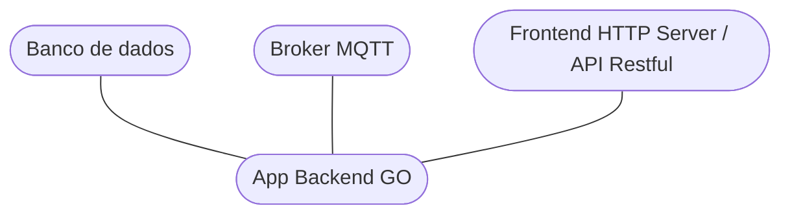

# backend
Código fonte da infraestrutura e aplicação do servidor da solução

# Estrutura do backend: 

```mermaid
flowchart TD
    DB([Banco de dados])
        DB --- backend

    mqtt([Broker MQTT])
        mqtt --- backend
    backend([App Backend GO])
        
    frontend([Frontend HTTP Server / API Restful])
        frontend --- backend
```
