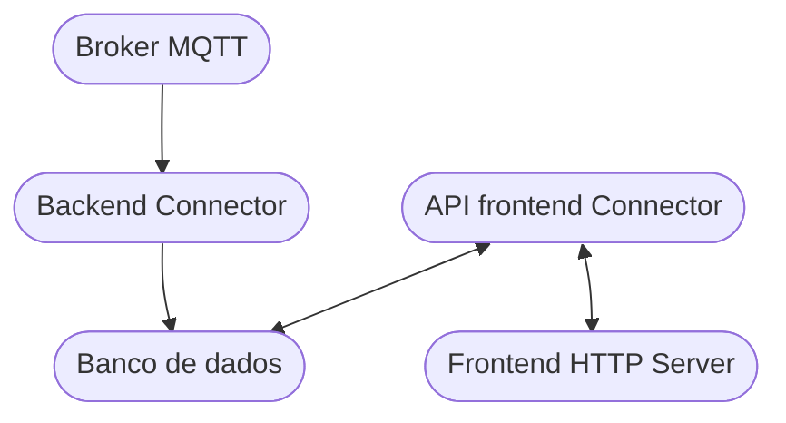
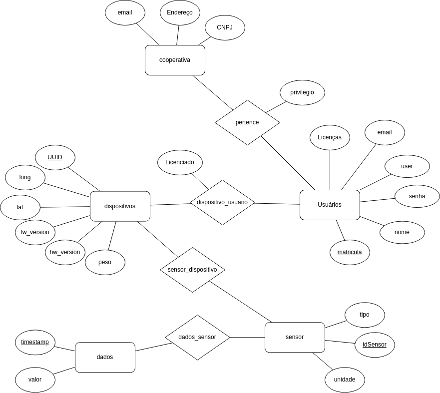
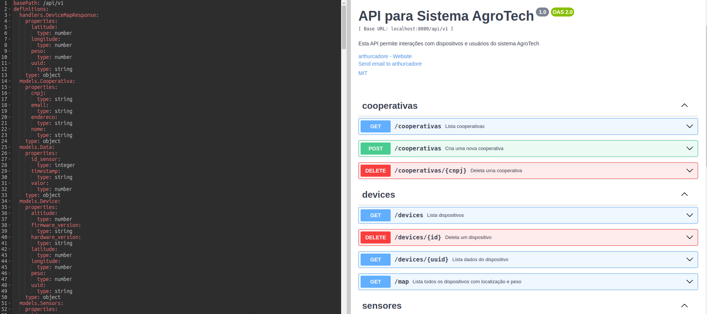

# Backend

Código fonte da aplicação de backend do projeto AgroTech.

## Estrutura



## Estrutura do banco

Imagem da estrutura do banco de dados:



## Mensageria 

A estrutura de mensagens para publicação no brokerMQTT é a seguinte: 

```
47e207dc-b841-4ddb-9b43-a93df6a73e7e%1=12%2=20%3=30
```
Onde os campos são: 

 - `47e207dc-b841-4ddb-9b43-a93df6a73e7e`: Corresponde ao UUID do device que está tentando publicar no banco (UUIDv4)

 - `1=12`: Corresponde a primeira tupla de valores id%valor do sensor que está publicando a mensagem (inteiro não nulo)

 - `2=20`: Corresponde a segunda tupla de valores id%valor do sensor que está publicando a mensagem (inteiro não nulo)

  - `3=30`: Corresponde a terceira tupla de valores id%valor do sensor que está publicando a mensagem (inteiro não nulo)

  - `%`: Caracter delimitador de parâmetros, separa os dados entre sensores. 

O mapeamento de valores do parâmetro `idsensor` no banco é o seguinte: 

```
1 - Temperatura
2 - Pressão
3 - luminosidade
4 - Umidade
5 - Corrente
6 - Tensão
```

## Documentação da API de backend

A documentação da API de backend pode ser acessada em /api/docs/swagger.yaml.

Para visualiza-la, acesse o site [Swagger Editor](https://editor.swagger.io/) e cole o conteúdo do arquivo.



## Arquivos sensíveis

### Banco de dados

- `database/secret-db`: senha do administrador do MySQL. Exemplo:

```ini
senha
```

- `database/setup.sql`: preparação do banco de dados. Exemplo:

```sql
CREATE DATABASE IF NOT EXISTS pjiot;
USE pjiot;

-- Usuário para conexão
CREATE USER 'connectoruser'@'%' IDENTIFIED BY 'connectorpasswrd';
GRANT ALL PRIVILEGES ON pjiot.* TO 'connectoruser'@'%';
FLUSH PRIVILEGES;
```

### Broker MQTT:

- `mqtt-broker/mosquitto.cfg`: variáveis de configuração ambiente.

```ini
MQTT_BROKER=mqtt-broker
MQTT_BROKER=mosquitto
MQTT_PORT=1883
```

# Inicialização

## Compilar os arquivos de connector

```bash
cd connector/ 
CGO_ENABLED=0 GOOS=linux GOARCH=amd64 go build -o apiconnector.out
```

## Compilar os arquivos de APIconnector

```bash
cd APIconnector/
CGO_ENABLED=0 GOOS=linux GOARCH=amd64 go build -o apiconnector.out
```

## Inicializar os containers

```bash
make
```
---